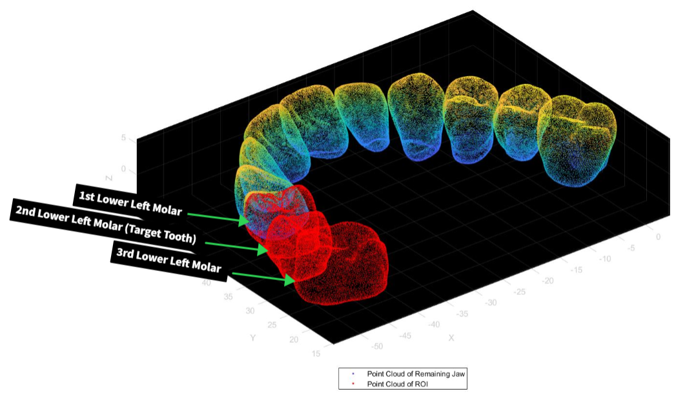
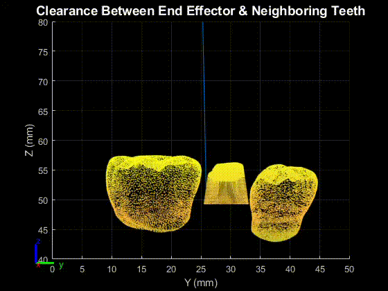

# rbe_501
*WPI RBE 501: Robot Dynamics, Course Project*  
*Team Celtics*

Modern robotics technologies have paved the way to automate several procedures in the dental industry. In this project we focus on implementing a workflow to automate the proximal and axial reduction steps required for dental crown preparation procedure  using a 6-DOF tendon sheath robot manipulator as descirbed in "A compact asymmetrical manipulator for robotic dentistry" in 2019 IEEE 9th AnnualInternational Conference on CYBER Technology in Automation, Control, and Intelligent Systems (CYBER). 

## Robot Modelling
MATLAB’s Robotic System Toolbox is utilised to model the asymmetric configuration of the 6-DOF robot. To perform the tooth milling and grinding  operations, a drill is used in the actual manipulator as the end-effector and, therefore, to mimic the drill’s tasks, a prismatic joint with a constant length is used

## Point Cloud Geometries
To generate the point cloud, a solid model of the lower jaw was processed using Solidworks to extract a set of 3 teeth under consideration.

## Contour and Waypoint Generation
Point cloud data is highly randomized. A range of Z values are chosen and all the points lying between this range are projected onto the mean of the Z coordinate. These projected points are then ordered to form a closed loop.  
To geenrate all the waypoints for the robot, the contours are inflated outward and split into 4 parts for the axial and proximal reduction procedures.

## Inverse Kinematics
The inverse kinematics function from the MATLAB Robotics System Toolbox was used based on the defined  robot DH table of the robot. The final transformation matrix at each point along the quarter was fed into the inverse kinematics function to calculate the corresponding pose of the robot in the joint space.

## Collision Free Trajectory and Collision Meshes
Generated collision meshes for the neighboring teeth as well as the upper and lower jaw. The neighboring teeth were generated as collision meshes from the denture model. The upper part and the lower jaw were simulated as collision boxes and were used to detect collisions

A 3D Rapidly Exploring Random Tree (RRT) algorithm for path planning was used to produce a collision-free trajectory

## Safety Validation
Clearance was measured at every point along the robot’s trajectory to ensure there is a tolerable distance between the tool-head and adjacent teeth. Since path planning was used with neighboring teeth,there is a guarantee that the tool will never come into contact with these teeth. These distances were plotted in an animated 3D plot showing lines between the end effector and the closest point in the point cloud.

## Animation

The minimum distnace between the end effector and the neighbouring teeth is 0.51mm

Youtube - [Presentation](https://www.youtube.com/watch?v=PazxKPg82kc)

### Acknowledgements
This study was performed under the guidance of Dr. Nobuhiko Hata. We, as team Celtics, would like to express our appreciation for Dr. Hata's great and insightful contributions to the team throughout the duration of the course.

*Team Celtics*  
Sagae Panchal, Aadiv Shah, Kshitij Sharma, Max Weissman